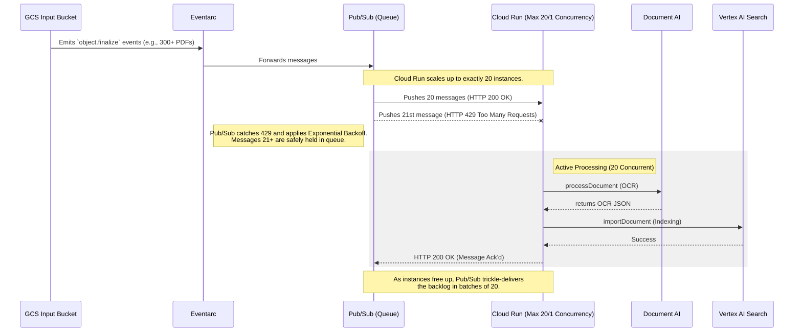

<!--
 Copyright 2026 Google LLC

 Licensed under the Apache License, Version 2.0 (the "License");
 you may not use this file except in compliance with the License.
 You may obtain a copy of the License at

      http://www.apache.org/licenses/LICENSE-2.0

 Unless required by applicable law or agreed to in writing, software
 distributed under the License is distributed on an "AS IS" BASIS,
 WITHOUT WARRANTIES OR CONDITIONS OF ANY KIND, either express or implied.
 See the License for the specific language governing permissions and
 limitations under the License.
-->

# Scalable Batch OCR Document Processor

This repository contains an auto-scaling batch Document AI and Vertex AI Search pipeline. It uses an event-driven architecture (Cloud Storage, Eventarc, Cloud Run) to ingest unstructured documents, extract text via Document AI, and import them into a Vertex AI Search index without hitting quota limits during traffic spikes.

## Core Features

Designed for reliability and throughput:

1. **Automated processing:** Upload a document to the input Cloud Storage bucket to trigger processing via Eventarc.
2. **Connection Pooling:** Google Cloud SDK clients are lazy-loaded globally to reuse connection pools across Cloud Run invocations, decreasing latency.
3. **Backpressure mitigation:** 1:1 container concurrency protects backend Vertex APIs by leveraging Pub/Sub retries when compute capacity is reached.
4. **Transient Error Handling:** Quota limits (`429`) and temporary server outages explicitly trigger Pub/Sub exponential backoff.
5. **Optimistic Concurrency Control:** Modifies GCS object metadata using `if_metageneration_match` to safely fail on concurrent modifications.
6. **Structured Logging:** Emits JSON payloads into Cloud Logging (`INFO`, `WARNING`, `ERROR`).
7. **Infrastructure-as-Code:** The `terraform/` directory provisions all required APIs, IAM roles, buckets, Cloud Run instances, and triggers.

## Architecture & Scaling (Concurrency Control)

To process massive batch uploads without exhausting API quotas, this pipeline uses **Pub/Sub Push Backpressure** and Cloud Run instance limits.



By setting `max_instance_count = 20` and `concurrency = 1` in Terraform, the Cloud Run load balancer automatically rejects excess traffic with HTTP `429 Too Many Requests`. The underlying Eventarc Pub/Sub push subscription natively interprets this 429 error and triggers exponential backoff delivery. This cleanly shifts the queueing logic out of the Python codebase into Google's Pub/Sub infrastructure.

## Directory Structure
```text
.
├── app/                  # Python batch OCR processor code (with Dockerfile)
├── terraform/            # Terraform configurations to deploy the entire pipeline
│   ├── main.tf           # Defines main resources (Buckets, SA, Eventarc, Cloud Run, Document AI, Vertex AI Search)
│   ├── variables.tf      # Configuration options for deployment (Regions, Project ID)
│   ├── provider.tf       # Google provider definitions
│   └── modules/          # Encapsulated component code (Cloud Run, GCS)
└── README.md             # This file
```

## Environment Variables

<!-- AUTO-GENERATED: derived from app/main.py required_vars and os.environ.get() calls -->

The Cloud Run service is configured entirely through environment variables. Terraform sets all of these automatically; when deploying manually they must be supplied to `gcloud run deploy --set-env-vars`.

| Variable | Required | Default | Description |
|----------|----------|---------|-------------|
| `GCP_PROJECT_ID` | Yes | — | GCP project ID the pipeline runs in |
| `DOCAI_PROCESSOR_ID` | Yes | — | Full Document AI processor resource name: `projects/PROJECT_NUMBER/locations/LOCATION/processors/ID` |
| `OCR_OUTPUT_BUCKET` | Yes | — | GCS bucket name (without `gs://`) where OCR JSON output is written |
| `SEARCH_DATA_STORE_ID` | Yes | — | Vertex AI Search data store ID (e.g. `ocr-document-store-v5`) |
| `DOCAI_LOCATION` | No | `us` | Document AI API multi-region endpoint. Must match the region the processor was created in. Valid: `us`, `eu` |
| `SEARCH_LOCATION` | No | `us` | Vertex AI Search API endpoint region. Valid: `global`, `us`, `eu` |

<!-- END AUTO-GENERATED -->

> **Note:** When deploying via Terraform, `SEARCH_LOCATION` is set from `var.discovery_engine_location` which defaults to `global`. The Python fallback default of `us` only applies if the variable is missing entirely, which will not happen in a Terraform-managed deployment.

## Local Development

The Python application uses [`uv`](https://github.com/astral-sh/uv) for fast Python packaging. The `Dockerfile` also uses `uv` to lock and compile dependencies.

Install `uv`:

```bash
# On Linux and macOS
curl -LsSf https://astral.sh/uv/install.sh | sh
```

Run tests:

```bash
cd app/
uv run pytest test_main.py
```

## How To Deploy From Scratch

### 1. Prerequisites

Install the following tools before starting:

*   [Google Cloud SDK (`gcloud`)](https://cloud.google.com/sdk/docs/install) — tested with v460+
*   [Terraform](https://developer.hashicorp.com/terraform/downloads) >= v1.5.0
*   [Docker](https://docs.docker.com/get-docker/) — to build and push the container image

Verify versions:
```bash
gcloud --version
terraform -version
docker --version
```

### 2. Authenticate and Configure gcloud

```bash
# Log in interactively
gcloud auth login

# Set up Application Default Credentials (used by Terraform's Google provider)
gcloud auth application-default login

# Set your project as the default to avoid repeating --project flags
export PROJECT_ID="YOUR_PROJECT_ID"
gcloud config set project $PROJECT_ID
```

### 3. Enable Bootstrap APIs

Terraform enables most APIs automatically, but it needs a few to already be active before it can run — specifically Artifact Registry (to store the image) and the services that underpin the Terraform Google provider itself.

```bash
gcloud services enable \
  artifactregistry.googleapis.com \
  cloudresourcemanager.googleapis.com \
  iam.googleapis.com \
  --project=$PROJECT_ID
```

> Terraform's `main.tf` enables `documentai.googleapis.com`, `discoveryengine.googleapis.com`, `aiplatform.googleapis.com`, and `eventarc.googleapis.com` automatically during `apply`. Cloud Run, Cloud Storage, Pub/Sub, and Cloud Logging APIs are enabled by default in all GCP projects.

### 4. Create an Artifact Registry Repository and Push the Image

Set the variables used throughout the build and push steps:

```bash
export REGION="us-central1"       # Must match the 'region' you'll set in terraform.tfvars
export REPO_NAME="repo"           # Must match 'docker_repo_name' in terraform.tfvars
export IMAGE_NAME="ocr-processor"
export IMAGE_TAG="latest"
export IMAGE_URI="${REGION}-docker.pkg.dev/${PROJECT_ID}/${REPO_NAME}/${IMAGE_NAME}:${IMAGE_TAG}"
```

Create the repository:

```bash
gcloud artifacts repositories create $REPO_NAME \
  --repository-format=docker \
  --location=$REGION \
  --project=$PROJECT_ID
```

Authenticate Docker to push to Artifact Registry:

```bash
gcloud auth configure-docker ${REGION}-docker.pkg.dev
```

Build and push the image:

```bash
cd app/

docker build -t $IMAGE_URI .

docker push $IMAGE_URI
```

Verify the image is present:

```bash
gcloud artifacts docker images list ${REGION}-docker.pkg.dev/${PROJECT_ID}/${REPO_NAME} \
  --project=$PROJECT_ID
```

### 5. Deploy Infrastructure via Terraform

```bash
cd ../terraform/
terraform init
```

Create a `terraform.tfvars` file — all values must be concrete strings, no variable references:

```hcl
project_id       = "YOUR_PROJECT_ID"
region           = "us-central1"
docker_repo_name = "repo"

# Optional overrides (defaults shown):
# docai_location             = "us"     # Document AI multi-region: "us" or "eu" only
# discovery_engine_location  = "global" # Vertex AI Search location: "global", "us", or "eu"
```

> **Location constraints:**
> - `docai_location`: Document AI only supports `"us"` or `"eu"` as multi-region endpoints. Single regions (e.g. `"us-central1"`) are not valid here.
> - `discovery_engine_location`: Vertex AI Search supports `"global"`, `"us"`, or `"eu"`. The default `"global"` is recommended unless you have data residency requirements.
> - `region`: The Cloud Run service and Eventarc trigger region. This can be any standard GCP region (e.g. `"us-central1"`, `"europe-west1"`).

Review what Terraform will create before applying:

```bash
terraform plan
```

Apply (Terraform will prompt for confirmation):

```bash
terraform apply
```

This creates:
- Service account `ocr-processor-sa` with Document AI, Vertex AI Search, Storage, Eventarc, and Cloud Run Invoker roles
- GCS input bucket: `YOUR_PROJECT_ID-ocr-input`
- GCS output bucket: `YOUR_PROJECT_ID-ocr-output`
- Document AI OCR processor
- Vertex AI Search data store (`ocr-document-store-v5`)
- Cloud Run service (`ocr-processor-service`, max 20 instances, concurrency 1)
- Eventarc trigger listening for `google.cloud.storage.object.v1.finalized` on the input bucket

### 6. Test the Pipeline

Upload a PDF to the input bucket to trigger the pipeline end-to-end:

```bash
gsutil cp sample.pdf gs://${PROJECT_ID}-ocr-input/
```

Check processing status via the object's metadata (set by the processor):

```bash
gsutil stat gs://${PROJECT_ID}-ocr-input/sample.pdf
```

Look for `ocr_status: SUCCESS` in the metadata output. Possible values:
- `SUCCESS` — OCR and Vertex AI Search indexing both completed
- `OCR_SUCCESS_INDEX_FAILED` — OCR completed but Vertex AI Search import failed; the JSON is in the output bucket
- `FAILED` — Document AI processing failed; `ocr_error` metadata contains the error

Verify the OCR JSON output was written:

```bash
gsutil ls gs://${PROJECT_ID}-ocr-output/
```

### 7. Monitor with Cloud Logging

Stream live logs from the Cloud Run service:

```bash
gcloud logging read \
  'resource.type="cloud_run_revision" AND resource.labels.service_name="ocr-processor-service"' \
  --project=$PROJECT_ID \
  --freshness=10m \
  --format="value(timestamp, jsonPayload.message)" \
  --order=asc
```

Or open the Cloud Run console directly:

```bash
gcloud run services describe ocr-processor-service \
  --region=$REGION \
  --project=$PROJECT_ID \
  --format="value(status.url)"
```

Eventarc trigger details:

```bash
gcloud eventarc triggers describe ocr-processor-trigger \
  --location=$REGION \
  --project=$PROJECT_ID
```

### 8. Tear Down

To destroy all resources created by Terraform:

```bash
cd terraform/
terraform destroy
```

> The GCS buckets use `force_destroy = false` by default (see `modules/gcs-bucket/variables.tf`). If the buckets contain objects, `terraform destroy` will fail on them. Either empty the buckets first or set `force_destroy = true` in the module calls in `main.tf` before destroying.

```bash
# Empty buckets before destroying if needed
gsutil -m rm -r gs://${PROJECT_ID}-ocr-input/**
gsutil -m rm -r gs://${PROJECT_ID}-ocr-output/**
```

The Artifact Registry repository and its images are not managed by Terraform (you created it manually in step 4). Delete it separately if needed:

```bash
gcloud artifacts repositories delete $REPO_NAME \
  --location=$REGION \
  --project=$PROJECT_ID
```

## Deploying Without Terraform (gcloud Only)

This section deploys the same pipeline using only `gcloud` CLI commands. All resource names and configuration values match the Terraform deployment exactly so the two paths are interchangeable.

### 1. Set Variables

Export these once — they are referenced throughout every step below.

```bash
export PROJECT_ID="YOUR_PROJECT_ID"
export REGION="us-central1"           # Cloud Run and Eventarc region
export DOCAI_LOCATION="us"            # Document AI: "us" or "eu" only
export SEARCH_LOCATION="global"       # Vertex AI Search: "global", "us", or "eu"
export REPO_NAME="repo"
export IMAGE_URI="${REGION}-docker.pkg.dev/${PROJECT_ID}/${REPO_NAME}/ocr-processor:latest"
export SA_EMAIL="ocr-processor-sa@${PROJECT_ID}.iam.gserviceaccount.com"
export DATA_STORE_ID="ocr-document-store-v5"
```

### 2. Authenticate

```bash
gcloud auth login
gcloud auth application-default login
gcloud config set project $PROJECT_ID
```

### 3. Enable All Required APIs

```bash
gcloud services enable \
  artifactregistry.googleapis.com \
  cloudresourcemanager.googleapis.com \
  iam.googleapis.com \
  run.googleapis.com \
  storage.googleapis.com \
  pubsub.googleapis.com \
  logging.googleapis.com \
  eventarc.googleapis.com \
  documentai.googleapis.com \
  discoveryengine.googleapis.com \
  aiplatform.googleapis.com \
  --project=$PROJECT_ID
```

### 4. Create Service Account and IAM Bindings

```bash
gcloud iam service-accounts create ocr-processor-sa \
  --display-name="OCR Processor Service Account" \
  --project=$PROJECT_ID

# Grant the five roles the processor needs
for ROLE in \
  roles/documentai.apiUser \
  roles/discoveryengine.editor \
  roles/storage.objectAdmin \
  roles/eventarc.eventReceiver \
  roles/run.invoker; do
  gcloud projects add-iam-policy-binding $PROJECT_ID \
    --member="serviceAccount:${SA_EMAIL}" \
    --role="$ROLE"
done

# Grant the GCS service agent permission to publish to Pub/Sub (required for Eventarc)
GCS_SA=$(gcloud storage service-agent --project=$PROJECT_ID)
gcloud projects add-iam-policy-binding $PROJECT_ID \
  --member="serviceAccount:${GCS_SA}" \
  --role="roles/pubsub.publisher"
```

### 5. Create GCS Buckets

```bash
# Input bucket
gcloud storage buckets create gs://${PROJECT_ID}-ocr-input \
  --project=$PROJECT_ID \
  --location=$REGION \
  --uniform-bucket-level-access

gcloud storage buckets add-iam-policy-binding gs://${PROJECT_ID}-ocr-input \
  --member="serviceAccount:${SA_EMAIL}" \
  --role="roles/storage.objectAdmin"

# Output bucket
gcloud storage buckets create gs://${PROJECT_ID}-ocr-output \
  --project=$PROJECT_ID \
  --location=$REGION \
  --uniform-bucket-level-access

gcloud storage buckets add-iam-policy-binding gs://${PROJECT_ID}-ocr-output \
  --member="serviceAccount:${SA_EMAIL}" \
  --role="roles/storage.objectAdmin"
```

### 6. Build and Push the Container Image

```bash
# Create Artifact Registry repository
gcloud artifacts repositories create $REPO_NAME \
  --repository-format=docker \
  --location=$REGION \
  --project=$PROJECT_ID

# Authenticate Docker to push to Artifact Registry
gcloud auth configure-docker ${REGION}-docker.pkg.dev

# Build and push
cd app/
docker build -t $IMAGE_URI .
docker push $IMAGE_URI
cd ..
```

### 7. Create the Document AI Processor

```bash
DOCAI_PROCESSOR_NAME=$(gcloud documentai processors create \
  --display-name="ocr-document-processor" \
  --type=OCR_PROCESSOR \
  --location=$DOCAI_LOCATION \
  --project=$PROJECT_ID \
  --format="value(name)")

echo "Processor resource name: $DOCAI_PROCESSOR_NAME"
```

The captured value is the full resource name (`projects/PROJECT_NUMBER/locations/LOCATION/processors/ID`). It is used verbatim as the `DOCAI_PROCESSOR_ID` environment variable in the next step.

### 8. Create the Vertex AI Search Data Store

The gcloud CLI for Discovery Engine is in alpha with limited coverage; use the REST API directly:

```bash
curl -s -X POST \
  -H "Authorization: Bearer $(gcloud auth print-access-token)" \
  -H "Content-Type: application/json" \
  "https://discoveryengine.googleapis.com/v1beta/projects/${PROJECT_ID}/locations/${SEARCH_LOCATION}/collections/default_collection/dataStores?dataStoreId=${DATA_STORE_ID}" \
  -d '{
    "displayName": "OCR Document Store",
    "industryVertical": "GENERIC",
    "solutionTypes": ["SOLUTION_TYPE_SEARCH"],
    "contentConfig": "CONTENT_REQUIRED"
  }'
```

Wait for the data store to be ready (typically 1–2 minutes) before deploying Cloud Run, then confirm:

```bash
curl -s \
  -H "Authorization: Bearer $(gcloud auth print-access-token)" \
  "https://discoveryengine.googleapis.com/v1beta/projects/${PROJECT_ID}/locations/${SEARCH_LOCATION}/collections/default_collection/dataStores/${DATA_STORE_ID}" \
  | python3 -c "import sys, json; d = json.load(sys.stdin); print(d.get('name', 'not ready yet'))"
```

### 9. Deploy the Cloud Run Service

```bash
gcloud run deploy ocr-processor-service \
  --image=$IMAGE_URI \
  --region=$REGION \
  --project=$PROJECT_ID \
  --service-account=$SA_EMAIL \
  --max-instances=20 \
  --concurrency=1 \
  --timeout=3600 \
  --no-allow-unauthenticated \
  --port=8080 \
  --set-env-vars="\
GCP_PROJECT_ID=${PROJECT_ID},\
DOCAI_LOCATION=${DOCAI_LOCATION},\
DOCAI_PROCESSOR_ID=${DOCAI_PROCESSOR_NAME},\
OCR_OUTPUT_BUCKET=${PROJECT_ID}-ocr-output,\
SEARCH_LOCATION=${SEARCH_LOCATION},\
SEARCH_DATA_STORE_ID=${DATA_STORE_ID}"
```

### 10. Create the Eventarc Trigger

```bash
gcloud eventarc triggers create ocr-processor-trigger \
  --location=$REGION \
  --project=$PROJECT_ID \
  --destination-run-service=ocr-processor-service \
  --destination-run-region=$REGION \
  --event-filters="type=google.cloud.storage.object.v1.finalized" \
  --event-filters="bucket=${PROJECT_ID}-ocr-input" \
  --service-account=$SA_EMAIL
```

Confirm the trigger is active:

```bash
gcloud eventarc triggers describe ocr-processor-trigger \
  --location=$REGION \
  --project=$PROJECT_ID
```

### 11. Test the Pipeline

Upload a PDF and poll the object metadata for the processing result:

```bash
gsutil cp sample.pdf gs://${PROJECT_ID}-ocr-input/

# Check status — look for ocr_status in the Metadata section
gsutil stat gs://${PROJECT_ID}-ocr-input/sample.pdf
```

See [step 6 of the Terraform path](#6-test-the-pipeline) for the full list of `ocr_status` values and what they mean.

### 12. Tear Down

Delete resources in reverse dependency order:

```bash
# Eventarc trigger
gcloud eventarc triggers delete ocr-processor-trigger \
  --location=$REGION --project=$PROJECT_ID

# Cloud Run service
gcloud run services delete ocr-processor-service \
  --region=$REGION --project=$PROJECT_ID

# Document AI processor
# List first to get the short processor ID
gcloud documentai processors list \
  --location=$DOCAI_LOCATION --project=$PROJECT_ID

# Then delete using the ID from the NAME column above
gcloud documentai processors delete PROCESSOR_ID \
  --location=$DOCAI_LOCATION --project=$PROJECT_ID

# Vertex AI Search data store
curl -s -X DELETE \
  -H "Authorization: Bearer $(gcloud auth print-access-token)" \
  "https://discoveryengine.googleapis.com/v1beta/projects/${PROJECT_ID}/locations/${SEARCH_LOCATION}/collections/default_collection/dataStores/${DATA_STORE_ID}"

# GCS buckets (empty first to avoid deletion failure)
gsutil -m rm -r "gs://${PROJECT_ID}-ocr-input/**" || true
gsutil -m rm -r "gs://${PROJECT_ID}-ocr-output/**" || true
gcloud storage buckets delete gs://${PROJECT_ID}-ocr-input --project=$PROJECT_ID
gcloud storage buckets delete gs://${PROJECT_ID}-ocr-output --project=$PROJECT_ID

# Service account
gcloud iam service-accounts delete $SA_EMAIL --project=$PROJECT_ID

# Artifact Registry repository and images
gcloud artifacts repositories delete $REPO_NAME \
  --location=$REGION --project=$PROJECT_ID
```

## Maintenance and Limits
*   The `max_instance_count` in Cloud Run is set to `20`. If uploading thousands of files at once, do NOT increase this without consulting your Vertex AI Search quota dashboard, as Document AI and Vertex limits can trigger HTTP `429` (Quota Exceeded) exceptions.
*   Concurrency defaults to `1` request per container to isolate memory usage per large PDF.

## License

Provided under the [Apache 2.0](https://www.apache.org/licenses/LICENSE-2.0) license. See the [LICENSE](./LICENSE.txt) file.

## Not Google Product Clause

This is not an officially supported Google product, nor is it part of an official Google product.