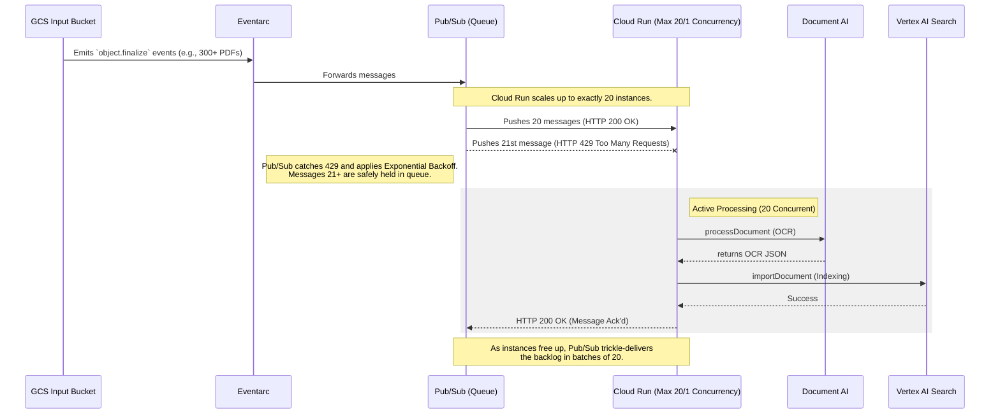

<!--
 Copyright 2026 Google LLC

 Licensed under the Apache License, Version 2.0 (the "License");
 you may not use this file except in compliance with the License.
 You may obtain a copy of the License at

      http://www.apache.org/licenses/LICENSE-2.0

 Unless required by applicable law or agreed to in writing, software
 distributed under the License is distributed on an "AS IS" BASIS,
 WITHOUT WARRANTIES OR CONDITIONS OF ANY KIND, either express or implied.
 See the License for the specific language governing permissions and
 limitations under the License.
-->

# Scalable Batch OCR Document Processor

This repository contains an auto-scaling batch Document AI and Vertex AI Search pipeline. It uses an event-driven architecture (Cloud Storage, Eventarc, Cloud Run) to ingest unstructured documents, extract text via Document AI, and import them into a Vertex AI Search index without exhausting API quotas during large batch uploads.

## Core Features

Designed for reliability and throughput:

- **Automated processing:** Upload a document to the input Cloud Storage bucket to trigger processing via Eventarc.
- **Connection Pooling:** Google Cloud SDK clients are lazy-loaded globally to reuse connection pools across Cloud Run invocations, decreasing latency.
- **Backpressure mitigation:** 1:1 container concurrency protects backend Vertex APIs by leveraging Pub/Sub retries when compute capacity is reached.
- **Transient Error Handling:** Quota limits (`429`) and temporary server outages explicitly trigger Pub/Sub exponential backoff.
- **Optimistic Concurrency Control:** Modifies GCS object metadata using `if_metageneration_match` to safely fail on concurrent modifications.
- **Structured Logging:** Emits JSON payloads into Cloud Logging (`INFO`, `WARNING`, `ERROR`).
- **Infrastructure-as-Code:** The `terraform/` directory provisions all required APIs, IAM roles, buckets, Cloud Run instances, and triggers.

## Architecture & Scaling

To process massive batch uploads without exhausting API quotas, this pipeline uses **Pub/Sub Push Backpressure** and Cloud Run instance limits.



By setting `max_instance_count = 20` and `concurrency = 1` in Terraform, the Cloud Run load balancer automatically rejects excess traffic with HTTP `429 Too Many Requests`. The underlying Eventarc Pub/Sub push subscription natively interprets this 429 error and triggers exponential backoff delivery. This cleanly shifts the queueing logic out of the Python codebase into Google's Pub/Sub infrastructure.

## Directory Structure
```text
.
├── app/                  # Python batch OCR processor code (with Dockerfile)
├── docs/                 # Deployment guides and operations runbook
│   ├── CODEMAPS/         # Architectural codemaps and visual guides (INDEX.md)
│   ├── deploy-terraform.md   # Terraform deployment path
│   ├── deploy-gcloud.md      # gcloud-only deployment path
│   └── runbook.md            # Operations runbook (monitoring, rollback, troubleshooting)
├── terraform/            # Terraform configurations to deploy the entire pipeline
│   ├── main.tf           # Defines main resources (Buckets, SA, Eventarc, Cloud Run, Document AI, Vertex AI Search)
│   ├── variables.tf      # Configuration options for deployment (Regions, Project ID)
│   ├── provider.tf       # Google provider definitions
│   └── modules/          # Encapsulated component code (Cloud Run, GCS)
└── README.md             # This file
```

## Local Development

The Python application uses [`uv`](https://github.com/astral-sh/uv) for fast Python packaging. The `Dockerfile` also uses `uv` to lock and compile dependencies.

Install `uv`:

```bash
# On Linux and macOS
curl -LsSf https://astral.sh/uv/install.sh | sh
```

Run tests:

```bash
cd app/
uv run pytest
```

### End-to-End Tests

To run the live E2E tests (requires `GCP_PROJECT_ID` and an authenticated environment with access to GCS and Document AI):

```bash
cd app/
uv run pytest ../tests/e2e
```

## Environment Variables

<!-- AUTO-GENERATED: derived from app/main.py required_vars and os.environ.get() calls -->

The Cloud Run service is configured entirely through environment variables. Terraform sets all of these automatically; when deploying manually they must be supplied to `gcloud run deploy --set-env-vars`.

| Variable | Required | Default | Description |
|----------|----------|---------|-------------|
| `GCP_PROJECT_ID` | Yes | — | GCP project ID the pipeline runs in |
| `DOCAI_PROCESSOR_ID` | Yes | — | Full Document AI processor resource name: `projects/PROJECT_NUMBER/locations/LOCATION/processors/ID` |
| `OCR_OUTPUT_BUCKET` | Yes | — | GCS bucket name (without `gs://`) where OCR JSON output is written |
| `SEARCH_DATA_STORE_ID` | Yes | — | Vertex AI Search data store ID (e.g. `ocr-document-store-v5`) |
| `DOCAI_LOCATION` | No | `us` | Document AI API multi-region endpoint. Must match the region the processor was created in. Valid: `us`, `eu` |
| `SEARCH_LOCATION` | No | `us` | Vertex AI Search API endpoint region. Valid: `global`, `us`, `eu` |

<!-- END AUTO-GENERATED -->

> **Note:** When deploying via Terraform, `SEARCH_LOCATION` is set from `var.discovery_engine_location` which defaults to `global`. The Python fallback default of `us` only applies if the variable is missing entirely, which will not happen in a Terraform-managed deployment.

## Deployment

Choose the path that matches your tooling:

| Path | Required tools | Best for |
|------|---------------|----------|
| [Terraform](docs/deploy-terraform.md) | gcloud, Terraform ≥ 1.5, Docker | Reproducible, IaC-managed deployments |
| [gcloud CLI](docs/deploy-gcloud.md) | gcloud, Docker | Quick setup without Terraform |

Both paths deploy identical infrastructure and produce the same running pipeline.

> **Quota note:** Cloud Run is capped at 20 instances with concurrency 1. Do not raise `max_instance_count` without first checking your Vertex AI Search and Document AI quota dashboards — quota exhaustion returns HTTP `429` and will stall the pipeline. Concurrency is fixed at 1 to isolate memory usage per large PDF.

## License

Provided under the [Apache 2.0](https://www.apache.org/licenses/LICENSE-2.0) license. See the [LICENSE](./LICENSE.txt) file.

*This is not an officially supported Google product, nor is it part of an official Google product.*