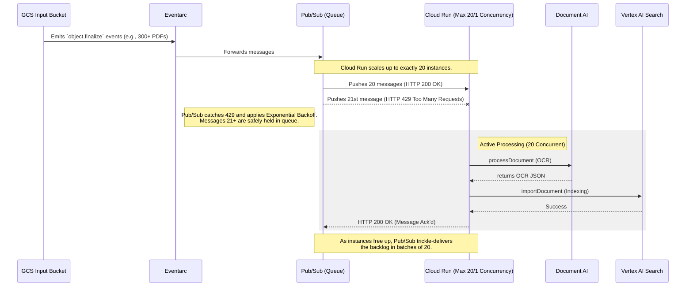

<!--
 Copyright 2026 Google LLC

 Licensed under the Apache License, Version 2.0 (the "License");
 you may not use this file except in compliance with the License.
 You may obtain a copy of the License at

      http://www.apache.org/licenses/LICENSE-2.0

 Unless required by applicable law or agreed to in writing, software
 distributed under the License is distributed on an "AS IS" BASIS,
 WITHOUT WARRANTIES OR CONDITIONS OF ANY KIND, either express or implied.
 See the License for the specific language governing permissions and
 limitations under the License.
-->

# Scalable Batch OCR Document Processor

This repository contains an auto-scaling batch Document AI and Vertex AI Search pipeline. It uses an event-driven architecture (Cloud Storage, Eventarc, Cloud Run) to ingest unstructured documents, extract text via Document AI, and import them into a Vertex AI Search index without hitting quota limits during traffic spikes.

## Core Features

Designed for reliability and throughput:

1. **Automated processing:** Upload a document to the input Cloud Storage bucket to trigger processing via Eventarc.
2. **Connection Pooling:** Google Cloud SDK clients are lazy-loaded globally to reuse connection pools across Cloud Run invocations, decreasing latency.
3. **Backpressure mitigation:** 1:1 container concurrency protects backend Vertex APIs by leveraging Pub/Sub retries when compute capacity is reached.
4. **Transient Error Handling:** Quota limits (`429`) and temporary server outages explicitly trigger Pub/Sub exponential backoff.
5. **Optimistic Concurrency Control:** Modifies GCS object metadata using `if_metageneration_match` to safely fail on concurrent modifications.
6. **Structured Logging:** Emits JSON payloads into Cloud Logging (`INFO`, `WARNING`, `ERROR`).
7. **Infrastructure-as-Code:** The `terraform/` directory provisions all required APIs, IAM roles, buckets, Cloud Run instances, and triggers.

## Architecture & Scaling (Concurrency Control)

To process massive batch uploads without exhausting API quotas, this pipeline uses **Pub/Sub Push Backpressure** and Cloud Run instance limits.



By setting `max_instance_count = 20` and `concurrency = 1` in Terraform, the Cloud Run load balancer automatically rejects excess traffic with HTTP `429 Too Many Requests`. The underlying Eventarc Pub/Sub push subscription natively interprets this 429 error and triggers exponential backoff delivery. This cleanly shifts the queueing logic out of the Python codebase into Google's Pub/Sub infrastructure.

## Directory Structure
```text
.
├── app/                  # Python batch OCR processor code (with Dockerfile & Makefile)
├── terraform/            # Terraform configurations to deploy the entire pipeline
│   ├── main.tf           # Defines main resources (Buckets, SA, Eventarc, Cloud Run, Document AI, Vertex AI Search)
│   ├── variables.tf      # Configuration options for deployment (Regions, Project ID)
│   ├── provider.tf       # Google provider definitions
│   └── modules/          # Encapsulated component code (Cloud Run, GCS)
└── README.md             # This file
```

## Local Development

The Python application uses [`uv`](https://github.com/astral-sh/uv) for fast Python packaging. The `Dockerfile` also uses `uv` to lock and compile dependencies.

Install `uv`:

```bash
# On Linux and macOS
curl -LsSf https://astral.sh/uv/install.sh | sh
```

Run tests:

```bash
cd app/
uv run pytest test_main.py
```

## How To Deploy From Scratch

### 1. Prerequisites
*   [Google Cloud SDK (`gcloud`)](https://cloud.google.com/sdk/docs/install)
*   [Terraform](https://developer.hashicorp.com/terraform/downloads) (>= v1.5.0)
*   Docker OR [uv](https://docs.astral.sh/uv/) for Python packaging

Authenticate with Google Cloud:
```bash
gcloud auth login
gcloud auth application-default login
```

### 2. Prepare the Application Image
The Cloud Run service needs the application image pushed to Artifact Registry before Terraform can deploy it. 

Create your repository:
```bash
export PROJECT_ID="YOUR_PROJECT_ID"
export REGION="us-central1"
export REPO_NAME="repo" # Update this to match what you use in variables if different

gcloud artifacts repositories create $REPO_NAME \
  --repository-format=docker \
  --location=$REGION \
  --project=$PROJECT_ID
```

Build and push the image:
```bash
cd app
make build
make push
```
*(Ensure the Makefile env vars correspond to your targeted `$PROJECT_ID`, `$REGION`, and `$REPO_NAME`)*

### 3. Deploy Infrastructure via Terraform

```bash
cd ../terraform
terraform init
```

Create a `terraform.tfvars` file:
```hcl
project_id       = "YOUR_PROJECT_ID"
region           = "us-central1"
docker_repo_name = "repo"
```

Apply:
```bash
terraform apply
```

### 4. Test the Pipeline

Once `terraform apply` completes, upload a PDF document to the new input bucket:

```bash
gsutil cp sample.pdf gs://YOUR_PROJECT_ID-ocr-input/
```

Monitor your Cloud Run Logs and Vertex AI Search Data Store.

## Maintenance and Limits
*   The `max_instance_count` in Cloud Run is set to `20`. If uploading thousands of files at once, do NOT increase this without consulting your Vertex AI Search quota dashboard, as Document AI and Vertex limits can trigger HTTP `429` (Quota Exceeded) exceptions.
*   Concurrency defaults to `1` request per container to isolate memory usage per large PDF.

## License

Provided under the [Apache 2.0](https://www.apache.org/licenses/LICENSE-2.0) license. See the [LICENSE](./LICENSE.txt) file.

## Not Google Product Clause

This is not an officially supported Google product, nor is it part of an official Google product.