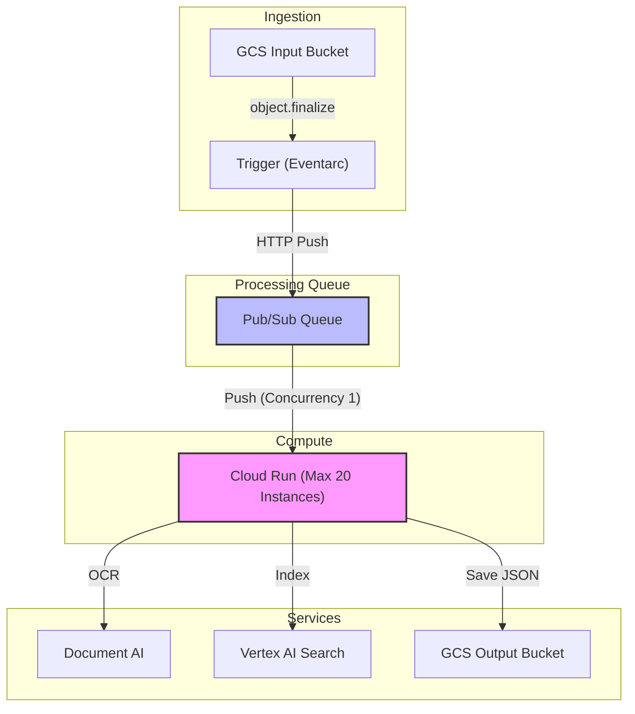

# Architecture Codemap - cloud-run-batch-ocr

**Last Updated:** 2026-04-02
**Entry Point:** `app/main.py`

This codemap describes the architecture of the Scalable Batch OCR Document Processor.

## System Architecture

The system uses an event-driven architecture on Google Cloud Platform to process documents at scale without exhausting API quotas.

## Key Modules

| Module/File | Purpose | Key Exports/Functions | Dependencies |
| :--- | :--- | :--- | :--- |
| `app/main.py` | Main worker handling Eventarc push events | `ocr_document_processor` | `google.cloud.documentai`, `google.cloud.storage`, `google.cloud.discoveryengine` |
| `terraform/main.tf` | Provisions all resources | N/A | Google Cloud Provider |
| `terraform/variables.tf` | Configures deployment | N/A | N/A |

## Data Flow

1.  **Ingestion**: User uploads PDF to Input Bucket.
2.  **Trigger**: Eventarc detects upload and sends to Pub/Sub.
3.  **Queue & Backpressure**: Pub/Sub pushes to Cloud Run. If Cloud Run is busy (concurrency 1, max instances 20), it returns 429. Pub/Sub backs off and retries.
4.  **OCR**: Cloud Run reads file from GCS, sends to Document AI for OCR.
5.  **Save**: Cloud Run saves OCR JSON to Output Bucket.
6.  **Index**: Cloud Run kicks off Vertex AI Search import.
7.  **Status**: Cloud Run updates GCS object metadata (`ocr_status=SUCCESS`).

## External Dependencies

- `google-cloud-documentai` - OCR processing
- `google-cloud-storage` - Intermediate storage and metadata
- `google-cloud-discoveryengine` - Vertex AI Search indexing
- `functions-framework` - Handling CloudEvents
